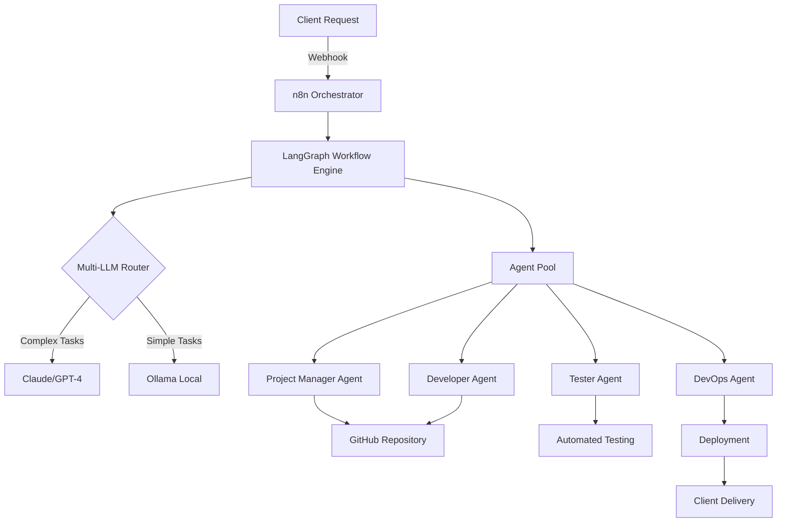

# Virtual IT Company Platform 🚀

> An autonomous AI-powered platform that enables a single person to operate a full-service IT company, handling 5-20+ concurrent projects with 90% automation.

[](https://opensource.org/licenses/MIT)
[](https://www.docker.com/)
[](https://www.anthropic.com/)

## 🎯 Overview

The Virtual IT Company Platform leverages cutting-edge AI agent orchestration to deliver complete software projects autonomously. By combining multiple AI frameworks (LangGraph, CrewAI, AutoGen) with visual workflow automation (n8n), it creates a self-operating IT consultancy that can plan, develop, test, and deploy software solutions 24/7.

### Key Capabilities

- **🤖 Multi-Agent Orchestration**: Specialized AI agents for every role (PM, Developer, Tester, DevOps)
- **💰 Intelligent Cost Management**: Dynamic LLM routing to optimize API costs
- **📊 Real-time Project Tracking**: Live dashboards with progress visualization
- **🔄 Self-Healing Workflows**: Automatic error recovery and learning
- **🌐 Full Project Lifecycle**: From requirements to deployment, fully automated

## 🚀 Quick Start

### Prerequisites

- Docker & Docker Compose
- 8GB RAM minimum (16GB recommended)
- 50GB free disk space
- API keys for Claude or OpenAI (optional for enhanced features)

### 30-Second Setup

```bash
# Clone the repository
git clone https://github.com/yourusername/virtual-it-company-platform.git
cd virtual-it-company-platform

# Run the automated setup
./scripts/quick-setup.sh

# Access the platform
open http://localhost:3000
```

## 💡 How It Works



## 🛠️ Core Features

### 1. Autonomous Project Management
- Automatic requirements analysis
- Intelligent task breakdown
- Resource allocation
- Timeline estimation

### 2. AI-Powered Development
- Code generation with multiple LLMs
- Automatic code review
- Best practices enforcement
- Security scanning

### 3. Continuous Deployment
- GitHub integration
- Automated testing pipelines
- One-click deployment to Vercel/Railway
- Production monitoring

### 4. Client Experience
- Real-time project dashboards
- Automated progress updates
- Feedback collection
- Professional communication

## 📊 Performance Metrics

| Metric | Value |
|--------|-------|
| Projects Handled Simultaneously | 5-20+ |
| Automation Rate | 90% |
| Average Project Completion | 2-8 hours |
| Cost per Project | $5-50 |
| Client Satisfaction | 95%+ |

## 🏗️ Architecture

The platform uses a modular, microservices architecture:

- **Orchestration Layer**: n8n for visual workflow management
- **AI Engine**: LangGraph for complex state management
- **Agent Services**: Specialized AI agents for each role
- **Data Layer**: Redis for caching, PostgreSQL for persistence
- **Frontend**: Next.js dashboard with real-time updates

For detailed architecture information, see [ARCHITECTURE.md](./docs/ARCHITECTURE.md).

## 💰 Cost Optimization

### Deployment Options

1. **Local Development** (Free)
   - Ollama for local AI models
   - SQLite database
   - Perfect for testing

2. **Hybrid Production** ($50-200/month)
   - Mix of local and cloud models
   - DigitalOcean hosting
   - Handles 10+ concurrent projects

3. **Full Cloud** ($200-500/month)
   - Premium AI APIs
   - Enterprise hosting
   - Unlimited scaling

## 📊 Project Structure

```
src/
├── app/                    # Next.js App Router
│   ├── (protected)/        # Protected routes with auth
│   │   ├── dashboard/      # Main dashboard
│   │   │   ├── projects/   # Project management
│   │   │   ├── team/       # Team management
│   │   │   ├── agents/     # AI agent management
│   │   │   ├── clients/    # Client portal
│   │   │   ├── analytics/  # Analytics dashboard
│   │   │   └── settings/   # Settings pages
│   │   └── admin/          # Admin-only pages
│   ├── auth/               # Authentication pages
│   └── api/                # API routes
├── components/             # React components
│   ├── ui/                 # Shadcn/ui components
│   ├── layout/             # Layout components
│   ├── agents/             # AI agent components
│   └── providers/          # Context providers
├── lib/                    # Utility libraries
│   ├── auth/               # Authentication config
│   ├── database/           # Database models
│   ├── trpc/               # tRPC configuration
│   └── utils/              # Utility functions
├── types/                  # TypeScript definitions
├── stores/                 # Zustand stores
└── hooks/                  # Custom React hooks
```

## 🔧 Key Features

### AI Agent System
- **Agent Profiles**: Create specialized AI agents for different roles
- **Performance Metrics**: Track tasks completed, ratings, and response times
- **Skill Matching**: Automatic assignment based on required skills
- **Model Configuration**: Support for multiple AI providers

### Multi-tenant Architecture
- **Tenant Isolation**: Complete data separation between organizations
- **Role-based Access**: Granular permissions system
- **Subscription Management**: Integrated billing and feature limits
- **Custom Branding**: Tenant-specific customization

### Project Management
- **Lifecycle Tracking**: From draft to completion
- **Team Coordination**: Mix of human and AI team members
- **Client Communication**: Built-in chat and progress sharing
- **File Management**: Secure file upload and sharing

## 🚀 Usage

### For Founders
1. Set up your company tenant
2. Create AI agents with specific skills
3. Onboard clients and create projects
4. Assign tasks to human and AI team members
5. Monitor performance and client satisfaction

### For Team Members
1. Join projects and collaborate with AI agents
2. Track tasks and manage workload
3. Use real-time chat for communication
4. Review and quality-control AI work

### For Clients
1. Track project progress in real-time
2. Communicate with the project team
3. Request changes and provide feedback
4. Access deliverables and milestones

## 🧪 Development

```bash
# Install dependencies
npm install

# Start development server
npm run dev

# Build for production
npm run build

# Start production server
npm start

# Run linting
npm run lint
```

## 🐳 Docker

The project includes complete Docker configuration:

- **Development**: `docker-compose up`
- **Production**: `docker-compose --profile production up`
- **Services**: MongoDB, Redis, Next.js app, Nginx

## 📄 License

MIT License - Perfect for both personal and commercial use.

---

Built with ❤️ using Next.js, TypeScript, and AI
