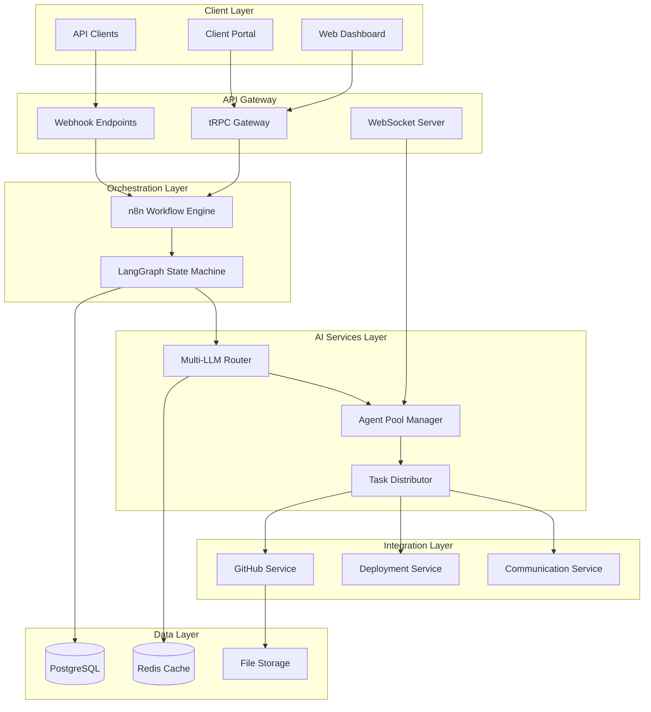
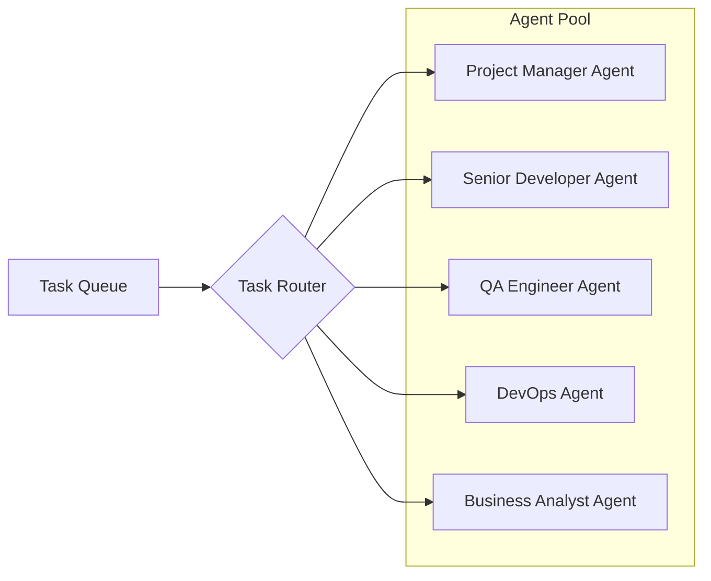
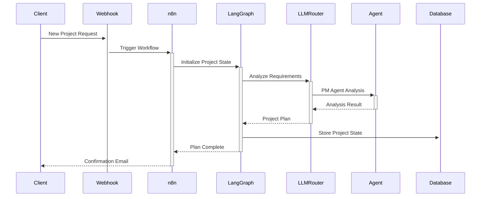
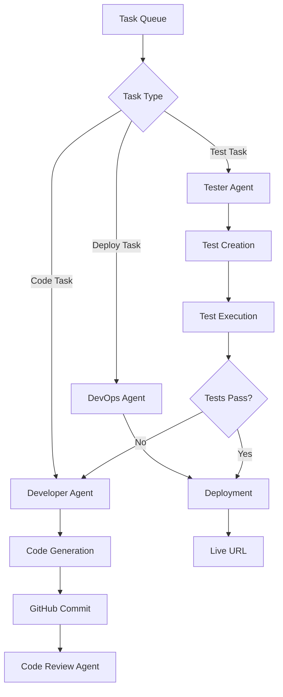
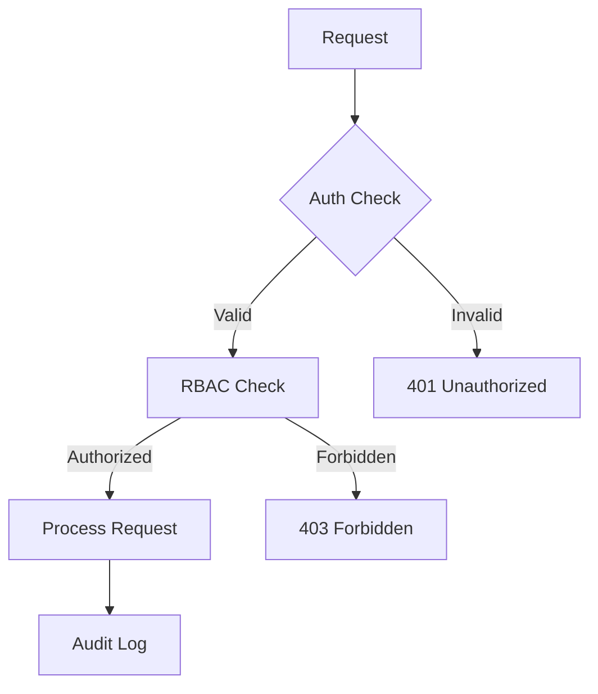
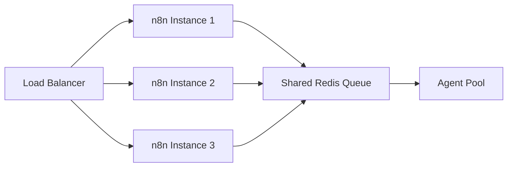

# Technical Architecture Document

## Table of Contents

1. [Architecture Overview](#architecture-overview)
2. [System Design Principles](#system-design-principles)
3. [Component Architecture](#component-architecture)
4. [Data Flow](#data-flow)
5. [Deployment Architecture](#deployment-architecture)
6. [Security Architecture](#security-architecture)
7. [Scalability Design](#scalability-design)

## Architecture Overview

The Virtual IT Company Platform employs a **layered microservices architecture** designed for autonomous operation, scalability, and cost efficiency. The system orchestrates multiple AI agents through visual workflows to deliver complete software projects without human intervention.



## System Design Principles

### 1. **Autonomous First**
- Systems operate without human intervention by default
- Self-healing mechanisms for error recovery
- Intelligent decision-making at every layer

### 2. **Cost-Optimized**
- Dynamic LLM selection based on task complexity
- Local model fallback for simple operations
- Resource pooling and efficient task batching

### 3. **Event-Driven**
- Webhook-triggered workflows
- Asynchronous task processing
- Real-time status updates via WebSockets

### 4. **Modular & Extensible**
- Plugin architecture for new AI frameworks
- Swappable LLM providers
- Custom workflow templates

### 5. **Resilient & Fault-Tolerant**
- Circuit breakers for external services
- Retry mechanisms with exponential backoff
- Graceful degradation strategies

## Component Architecture

### 1. Orchestration Components

#### n8n Workflow Engine
```yaml
Purpose: Visual workflow orchestration
Responsibilities:
  - Webhook handling
  - Workflow execution
  - Service coordination
  - Event routing
Technologies:
  - Node.js runtime
  - PostgreSQL persistence
  - Redis for queuing
```

#### LangGraph State Machine
```yaml
Purpose: Complex workflow state management
Responsibilities:
  - Project state tracking
  - Conditional branching
  - Multi-step workflows
  - Error state handling
Key Features:
  - Persistent state graphs
  - Checkpointing
  - State replay capability
```

### 2. AI Service Components

#### Multi-LLM Router
```python
class LLMRouter:
    """Intelligent routing between multiple LLM providers"""
    
    def select_model(self, task_type: str, complexity: int) -> LLMConfig:
        # Decision matrix for model selection
        if complexity >= 8:
            return self.get_premium_model()  # Claude Opus/GPT-4
        elif complexity >= 5:
            return self.get_standard_model()  # Claude Sonnet
        else:
            return self.get_efficient_model()  # Ollama/Haiku
```

#### Agent Pool Architecture


### 3. Integration Components

#### Service Adapters
- **GitHub Adapter**: Repository management, PR creation
- **Vercel Adapter**: Deployment automation
- **SendGrid Adapter**: Email notifications
- **Stripe Adapter**: Payment processing

## Data Flow

### 1. Project Initiation Flow


### 2. Development Flow


## Deployment Architecture

### 1. Container Architecture
```yaml
version: '3.9'
services:
  n8n:
    image: n8nio/n8n
    environment:
      - DB_TYPE=postgresdb
    depends_on:
      - postgres
      - redis
    
  langgraph:
    build: ./services/langgraph
    environment:
      - REDIS_URL=redis://redis:6379
    depends_on:
      - redis
      - ollama
    
  ollama:
    image: ollama/ollama
    volumes:
      - ./models:/root/.ollama
    deploy:
      resources:
        reservations:
          devices:
            - capabilities: [gpu]
    
  postgres:
    image: postgres:15
    volumes:
      - postgres_data:/var/lib/postgresql/data
    
  redis:
    image: redis:7-alpine
    volumes:
      - redis_data:/data
```

### 2. Scaling Strategy

#### Horizontal Scaling
- **Agent Services**: Stateless, scale based on queue depth
- **n8n Workers**: Multiple workers for parallel workflows
- **LLM Requests**: Connection pooling and rate limiting

#### Vertical Scaling
- **Database**: Read replicas for analytics
- **Redis**: Cluster mode for high throughput
- **File Storage**: CDN for static assets

## Security Architecture

### 1. Authentication & Authorization


### 2. Data Security
- **Encryption at Rest**: AES-256 for sensitive data
- **Encryption in Transit**: TLS 1.3 for all communications
- **Key Management**: Rotating API keys, HashiCorp Vault
- **Data Isolation**: Tenant-based data separation

### 3. API Security
- **Rate Limiting**: Token bucket algorithm
- **Input Validation**: Schema validation on all inputs
- **Output Sanitization**: Prevent data leakage
- **CORS Policy**: Strict origin validation

## Scalability Design

### 1. Load Distribution


### 2. Performance Optimization
- **Caching Strategy**: Redis for hot data, 15-minute TTL
- **Database Indexing**: Optimized for common queries
- **Async Processing**: Non-blocking operations
- **Resource Pooling**: Connection reuse

### 3. Monitoring Architecture
```yaml
Metrics Collection:
  - Prometheus for system metrics
  - Custom metrics for AI operations
  - Real-time dashboards with Grafana

Logging:
  - Structured JSON logging
  - Centralized log aggregation
  - Log retention policies

Alerting:
  - Cost threshold alerts
  - Error rate monitoring
  - Performance degradation alerts
```

## Architecture Decisions

### ADR-001: Multi-LLM Strategy
**Decision**: Use multiple LLM providers with intelligent routing
**Rationale**: Balances cost, performance, and reliability
**Consequences**: Complex routing logic but 70% cost savings

### ADR-002: Event-Driven Architecture
**Decision**: Use webhooks and message queues for async processing
**Rationale**: Enables scalability and resilience
**Consequences**: Eventually consistent but highly scalable

### ADR-003: Hybrid Deployment Model
**Decision**: Support both local and cloud deployment
**Rationale**: Reduces barrier to entry, enables gradual scaling
**Consequences**: Additional complexity in configuration management

---

This architecture provides a robust foundation for building an autonomous IT company that can scale from a single developer to handling dozens of concurrent projects while maintaining quality and cost efficiency.