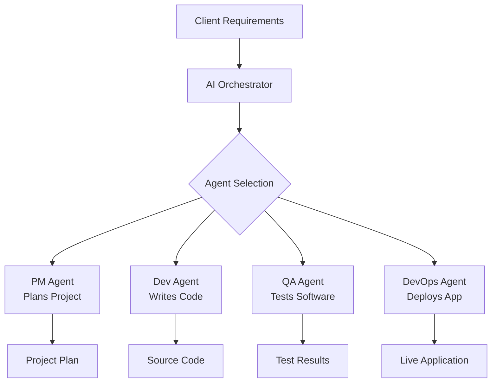
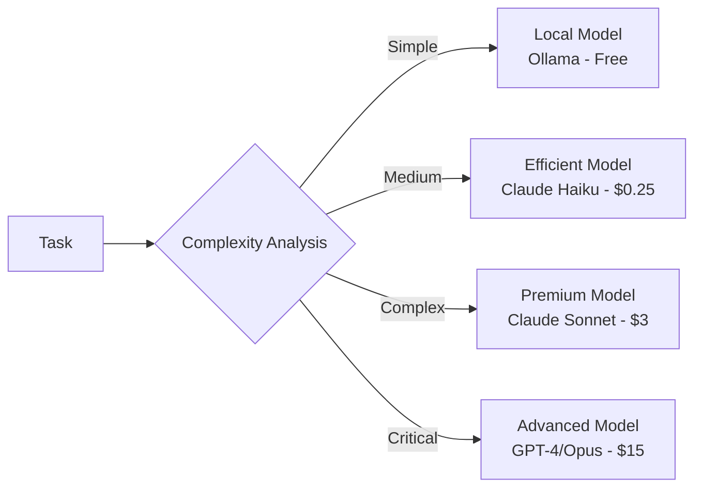
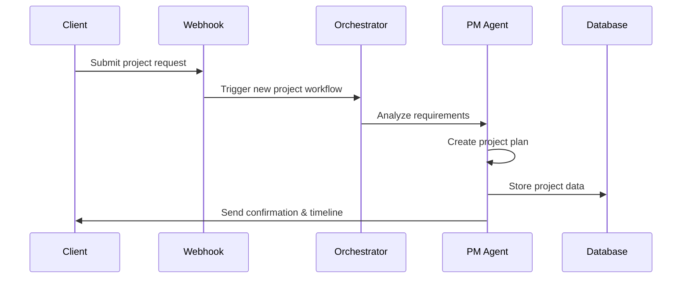
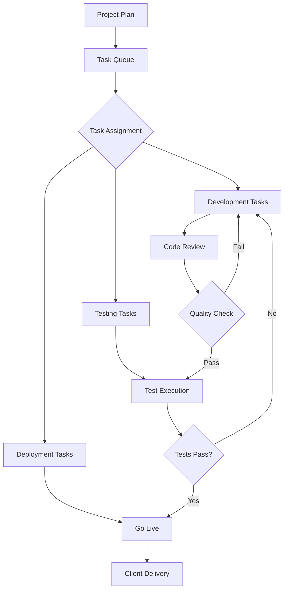
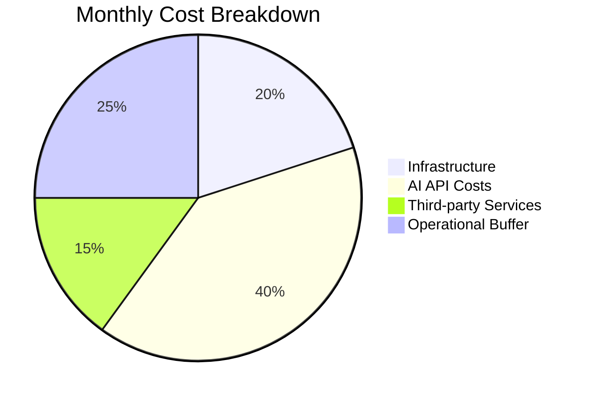

# System Overview Document

## Executive Summary

The Virtual IT Company Platform is an autonomous software development system that enables a single operator to run a full-scale IT consultancy. By orchestrating specialized AI agents through intelligent workflows, it delivers complete software projects from conception to deployment with minimal human intervention.

## Table of Contents

1. [System Purpose](#system-purpose)
2. [Core Concepts](#core-concepts)
3. [System Components](#system-components)
4. [Operational Flow](#operational-flow)
5. [Key Features](#key-features)
6. [User Roles](#user-roles)
7. [Business Model](#business-model)
8. [Success Metrics](#success-metrics)

## System Purpose

### Problem Statement
Traditional IT consultancies face significant challenges:
- **High operational costs** from large human teams
- **Limited availability** (business hours only)
- **Scalability constraints** tied to hiring
- **Quality inconsistency** across different developers
- **Project management overhead**

### Solution
The Virtual IT Company Platform addresses these challenges by:
- **Automating 90%** of software development tasks
- Operating **24/7** without breaks or downtime
- **Scaling instantly** to handle multiple projects
- Ensuring **consistent quality** through AI agents
- **Reducing costs** by 80% compared to traditional teams

## Core Concepts

### 1. AI Agent Orchestration

### 2. Workflow Automation
The platform uses **n8n** for visual workflow design, enabling:
- Drag-and-drop workflow creation
- Integration with 200+ services
- Custom logic implementation
- Error handling and retries

### 3. Intelligent LLM Routing

## System Components

### 1. Frontend Layer

#### Client Dashboard
- **Real-time project tracking** with live updates
- **Interactive chat** with project team
- **File management** and deliverable downloads
- **Progress visualization** with charts and timelines
- **Feedback system** for iterative improvements

#### Admin Portal
- **Agent management** and configuration
- **Workflow designer** for custom processes
- **Analytics dashboard** for business metrics
- **Cost monitoring** and optimization tools
- **Client management** interface

### 2. Backend Services

#### Orchestration Engine
Built on **LangGraph**, providing:
- State machine for complex workflows
- Conditional branching logic
- Error recovery mechanisms
- Checkpoint and replay capabilities

#### Agent Services
Specialized agents for each role:

| Agent Type | Primary Responsibilities | Key Skills |
|------------|-------------------------|------------|
| Project Manager | Requirements analysis, planning, coordination | Strategic thinking, communication |
| Senior Developer | Architecture design, code implementation | Multiple languages, best practices |
| QA Engineer | Test planning, automation, quality assurance | Testing frameworks, bug detection |
| DevOps Engineer | CI/CD, deployment, infrastructure | Cloud platforms, automation tools |
| Business Analyst | Market research, documentation | Analysis, documentation |

#### Integration Services
- **GitHub**: Version control and collaboration
- **Vercel/Railway**: Automated deployment
- **SendGrid**: Email communications
- **Stripe**: Payment processing
- **AWS S3**: File storage

### 3. Data Layer

#### Primary Database (PostgreSQL)
- Project metadata and state
- User accounts and permissions
- Agent performance metrics
- Financial transactions

#### Cache Layer (Redis)
- Active project states
- Agent availability
- Rate limiting counters
- Session management

#### File Storage
- Project deliverables
- Documentation
- Client uploads
- Agent artifacts

## Operational Flow

### 1. Project Initiation

### 2. Development Cycle

### 3. Continuous Improvement
The system learns from each project:
- **Error patterns** are analyzed and prevented
- **Successful strategies** are reinforced
- **Client feedback** improves future projects
- **Performance metrics** optimize agent selection

## Key Features

### 1. Autonomous Operation
- **Self-managing workflows** that adapt to project needs
- **Automatic error recovery** without human intervention
- **Intelligent decision making** at every step
- **24/7 availability** for global clients

### 2. Quality Assurance
- **Automated code review** by specialized agents
- **Comprehensive testing** including unit and integration
- **Security scanning** for vulnerabilities
- **Performance optimization** built-in

### 3. Client Experience
- **Real-time visibility** into project progress
- **Professional communication** at every touchpoint
- **Rapid delivery** compared to traditional teams
- **Cost transparency** with detailed breakdowns

### 4. Scalability
- **Concurrent project handling** (5-20+ projects)
- **Dynamic resource allocation** based on demand
- **Horizontal scaling** for increased capacity
- **Cost-effective growth** without hiring

## User Roles

### 1. Platform Operator (You)
- Configure AI agents and workflows
- Monitor system performance
- Handle escalations
- Optimize costs and efficiency

### 2. Clients
- Submit project requirements
- Track progress in real-time
- Provide feedback
- Receive deliverables

### 3. AI Agents
- Execute assigned tasks autonomously
- Collaborate with other agents
- Learn from outcomes
- Report status updates

## Business Model

### Revenue Streams
1. **Project-based pricing**: Fixed fee per project complexity
2. **Subscription model**: Monthly plans for ongoing work
3. **Enterprise contracts**: Custom solutions for large clients
4. **Maintenance packages**: Ongoing support and updates

### Cost Structure

### Pricing Strategy
| Project Type | Complexity | Delivery Time | Price Range |
|--------------|------------|---------------|-------------|
| Landing Page | Simple | 2-4 hours | $500-1,000 |
| Web Application | Medium | 8-16 hours | $2,000-5,000 |
| Mobile App | Complex | 24-48 hours | $5,000-10,000 |
| Enterprise System | Very Complex | 1-2 weeks | $10,000-25,000 |

## Success Metrics

### Technical Metrics
- **Automation Rate**: Target 90%+ task automation
- **Error Rate**: <5% requiring human intervention
- **Delivery Speed**: 10x faster than traditional teams
- **Uptime**: 99.9% system availability

### Business Metrics
- **Project Success Rate**: 95%+ client satisfaction
- **Revenue per Project**: Average $2,500
- **Profit Margin**: 70-80% after costs
- **Growth Rate**: 50% month-over-month

### Quality Metrics
- **Code Quality Score**: 8.5/10 average
- **Bug Density**: <0.5 bugs per KLOC
- **Test Coverage**: 80%+ automated tests
- **Security Score**: A+ rating

## Future Vision

The platform is designed to evolve:

1. **Advanced AI Capabilities**: Integration with newer models
2. **Industry Specialization**: Vertical-specific agents
3. **White-label Solution**: Enable others to run their own
4. **Global Marketplace**: Connect with human specialists
5. **AI Team Expansion**: Designers, marketers, data scientists

---

The Virtual IT Company Platform represents a paradigm shift in software development, making it possible for anyone to operate a sophisticated IT consultancy with minimal overhead and maximum efficiency.