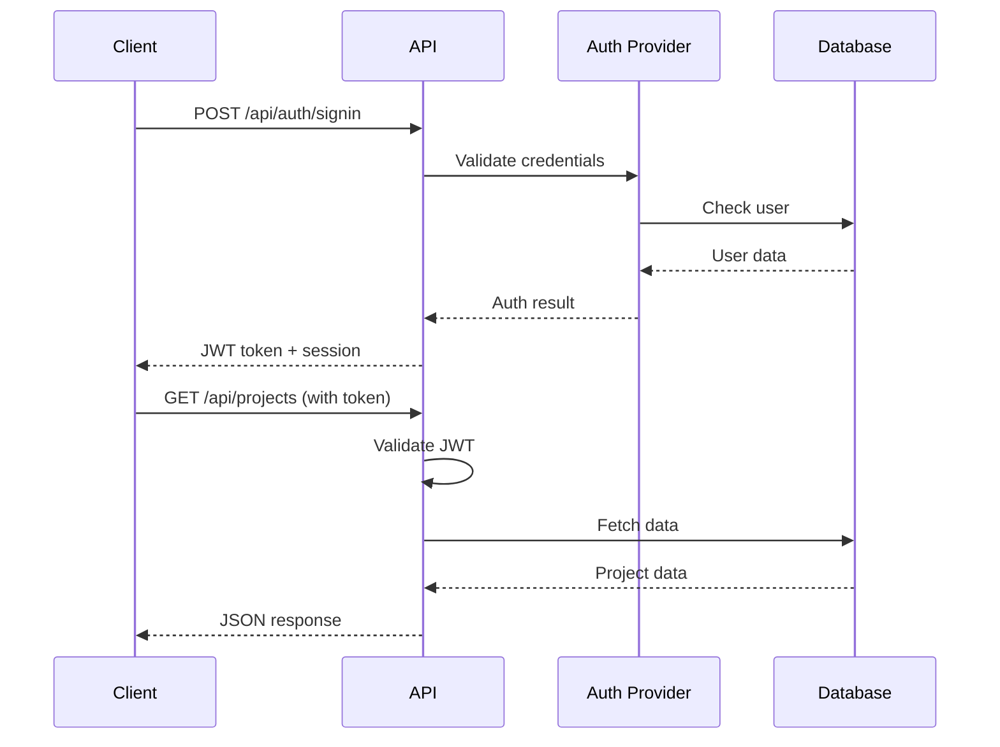

# Virtual IT Company Platform - API Documentation

## Overview

The Virtual IT Company Platform provides a comprehensive API for managing AI-powered software development projects. This document covers all available endpoints, authentication methods, and integration guidelines.

## Base URLs

```
Development: http://localhost:3000/api
Staging: https://staging-api.yourdomain.com
Production: https://api.yourdomain.com
```

## Authentication

The API uses JWT-based authentication with NextAuth.js. All protected endpoints require a valid authentication token.

### Authentication Flow



### Authentication Endpoints

#### Sign In
```http
POST /api/auth/signin
Content-Type: application/json

{
  "email": "user@example.com",
  "password": "secure_password"
}
```

Response:
```json
{
  "user": {
    "id": "clh1234567890",
    "email": "user@example.com",
    "name": "John Doe",
    "role": "CLIENT"
  },
  "token": "eyJhbGciOiJIUzI1NiIs...",
  "expires": "2024-01-01T00:00:00Z"
}
```

#### Sign Out
```http
POST /api/auth/signout
Authorization: Bearer <token>
```

#### Get Session
```http
GET /api/auth/session
Authorization: Bearer <token>
```

## tRPC API

The platform uses tRPC for type-safe API calls. All tRPC endpoints are available at `/api/trpc/[trpc]`.

### Project Router

#### Create Project
```typescript
// Input
{
  name: string;
  requirements: string;
  budget?: number;
  deadline?: string;
}

// Output
{
  id: string;
  name: string;
  requirements: string;
  status: ProjectStatus;
  budget: number | null;
  deadline: Date | null;
  createdAt: Date;
  updatedAt: Date;
  clientId: string;
  tenantId: string;
}
```

Example:
```typescript
const project = await trpc.project.create.mutate({
  name: "E-commerce Platform",
  requirements: "Build a modern e-commerce platform with payment integration",
  budget: 5000,
  deadline: "2024-03-01"
});
```

#### List Projects
```typescript
// Input
{
  status?: ProjectStatus;
  limit?: number;
  offset?: number;
}

// Output
{
  projects: Project[];
  total: number;
  hasMore: boolean;
}
```

#### Get Project
```typescript
// Input
{
  id: string;
}

// Output
{
  ...Project;
  tasks: Task[];
  deployments: Deployment[];
  realtimeStatus: {
    currentPhase: string;
    progress: number;
    activeAgents: string[];
    lastUpdate: string;
  };
}
```

#### Update Project Status
```typescript
// Input
{
  projectId: string;
  status: ProjectStatus;
}

// Output
{
  success: boolean;
  project: Project;
}
```

### Task Router

#### Create Task
```typescript
// Input
{
  projectId: string;
  title: string;
  description?: string;
  assignedTo?: string;
}

// Output
{
  id: string;
  title: string;
  description: string | null;
  status: TaskStatus;
  projectId: string;
  assignedTo: string | null;
  createdAt: Date;
}
```

#### Update Task
```typescript
// Input
{
  taskId: string;
  status?: TaskStatus;
  code?: string;
  tests?: string;
}

// Output
{
  ...Task;
  code: string | null;
  tests: string | null;
  completedAt: Date | null;
}
```

#### List Tasks
```typescript
// Input
{
  projectId: string;
  status?: TaskStatus;
}

// Output
Task[]
```

### Agent Router

#### List Available Agents
```typescript
// Input
{
  role?: string;
  status?: AgentStatus;
}

// Output
{
  agents: AIAgent[];
  statistics: {
    total: number;
    available: number;
    busy: number;
    offline: number;
  };
}
```

#### Assign Agent to Task
```typescript
// Input
{
  taskId: string;
  agentId: string;
}

// Output
{
  success: boolean;
  assignment: {
    taskId: string;
    agentId: string;
    assignedAt: Date;
  };
}
```

#### Get Agent Performance
```typescript
// Input
{
  agentId: string;
  timeframe?: '24h' | '7d' | '30d';
}

// Output
{
  agentId: string;
  metrics: {
    tasksCompleted: number;
    averageCompletionTime: number;
    successRate: number;
    totalTokensUsed: number;
    totalCost: number;
  };
  recentTasks: Task[];
}
```

## REST API Endpoints

### Webhooks

#### New Project Webhook
```http
POST /api/webhooks/new-project
Content-Type: application/json
X-Webhook-Secret: <your-webhook-secret>

{
  "project_name": "Mobile App",
  "requirements": "Create a React Native mobile app",
  "client_email": "client@example.com",
  "budget_limit": 3000,
  "priority": "high"
}
```

Response:
```json
{
  "status": "accepted",
  "project_id": "proj_abc123",
  "message": "Project workflow initiated",
  "tracking_url": "https://app.yourdomain.com/projects/proj_abc123"
}
```

#### n8n Callback Webhook
```http
POST /api/webhooks/n8n/callback
Content-Type: application/json

{
  "event": "workflow.completed",
  "workflowId": "workflow_123",
  "projectId": "proj_abc123",
  "status": "success",
  "data": {
    "github_repo": "https://github.com/org/project",
    "deployment_url": "https://project.vercel.app"
  }
}
```

### Health Check

```http
GET /api/health
```

Response:
```json
{
  "status": "healthy",
  "checks": {
    "database": true,
    "redis": true,
    "ollama": true,
    "n8n": true
  },
  "version": "1.0.0",
  "timestamp": "2024-01-01T00:00:00Z"
}
```

### AI Agent Endpoints

#### Execute Agent Task
```http
POST /api/agents/execute
Authorization: Bearer <token>
Content-Type: application/json

{
  "agent": "developer",
  "task": {
    "type": "implement_feature",
    "data": {
      "feature": "User authentication",
      "requirements": "Implement JWT-based auth with email/password",
      "tech_stack": "Next.js, NextAuth, PostgreSQL"
    }
  },
  "context": {
    "project_id": "proj_abc123",
    "previous_code": null
  }
}
```

Response:
```json
{
  "success": true,
  "result": {
    "code": "// Generated implementation code...",
    "files": [
      {
        "path": "src/lib/auth.ts",
        "content": "..."
      },
      {
        "path": "src/app/api/auth/[...nextauth]/route.ts",
        "content": "..."
      }
    ],
    "explanation": "Implemented JWT authentication with...",
    "tokens_used": 1543,
    "model": "codellama",
    "cost": 0.00
  },
  "execution_time": 3.2
}
```

#### Get Agent Status
```http
GET /api/agents/status
Authorization: Bearer <token>
```

Response:
```json
{
  "agents": [
    {
      "id": "agent_pm_1",
      "name": "Project Manager",
      "status": "available",
      "current_task": null,
      "tasks_completed_today": 12
    },
    {
      "id": "agent_dev_1",
      "name": "Developer",
      "status": "busy",
      "current_task": {
        "id": "task_123",
        "project": "proj_abc123",
        "started_at": "2024-01-01T10:00:00Z"
      },
      "tasks_completed_today": 8
    }
  ],
  "summary": {
    "total_agents": 5,
    "available": 3,
    "busy": 2,
    "offline": 0
  }
}
```

### Project Management

#### Deploy Project
```http
POST /api/projects/{projectId}/deploy
Authorization: Bearer <token>
Content-Type: application/json

{
  "environment": "staging",
  "provider": "vercel",
  "configuration": {
    "domain": "project-staging.vercel.app",
    "env_vars": {
      "DATABASE_URL": "postgresql://..."
    }
  }
}
```

Response:
```json
{
  "deployment": {
    "id": "deploy_123",
    "project_id": "proj_abc123",
    "environment": "staging",
    "url": "https://project-staging.vercel.app",
    "status": "deploying",
    "created_at": "2024-01-01T00:00:00Z"
  },
  "logs_url": "https://app.yourdomain.com/deployments/deploy_123/logs"
}
```

#### Get Project Metrics
```http
GET /api/projects/{projectId}/metrics
Authorization: Bearer <token>
```

Response:
```json
{
  "project_id": "proj_abc123",
  "metrics": {
    "completion_percentage": 75,
    "tasks": {
      "total": 20,
      "completed": 15,
      "in_progress": 3,
      "pending": 2
    },
    "time": {
      "estimated_hours": 40,
      "actual_hours": 30,
      "remaining_hours": 10
    },
    "cost": {
      "budget": 5000,
      "spent": 3750,
      "ai_costs": 150,
      "remaining": 1250
    },
    "quality": {
      "code_coverage": 85,
      "tests_passing": 98,
      "lint_score": 92
    }
  },
  "timeline": {
    "start_date": "2024-01-01",
    "estimated_completion": "2024-02-01",
    "current_phase": "development",
    "milestones": [
      {
        "name": "Planning Complete",
        "date": "2024-01-05",
        "status": "completed"
      },
      {
        "name": "MVP Ready",
        "date": "2024-01-20",
        "status": "in_progress"
      }
    ]
  }
}
```

## WebSocket API

The platform provides real-time updates via WebSocket connections.

### Connection
```javascript
const socket = io('wss://api.yourdomain.com', {
  auth: {
    token: 'your-jwt-token'
  }
});
```

### Events

#### Subscribe to Project Updates
```javascript
// Subscribe
socket.emit('subscribe:project', { projectId: 'proj_abc123' });

// Listen for updates
socket.on('project:update', (data) => {
  console.log('Project update:', data);
  // {
  //   type: 'status_change',
  //   projectId: 'proj_abc123',
  //   oldStatus: 'development',
  //   newStatus: 'testing',
  //   timestamp: '2024-01-01T00:00:00Z'
  // }
});
```

#### Agent Activity Stream
```javascript
// Subscribe to all agent activity
socket.emit('subscribe:agents');

socket.on('agent:activity', (data) => {
  console.log('Agent activity:', data);
  // {
  //   agentId: 'agent_dev_1',
  //   agentName: 'Developer',
  //   activity: 'Implementing user authentication',
  //   projectId: 'proj_abc123',
  //   timestamp: '2024-01-01T00:00:00Z'
  // }
});
```

#### Task Updates
```javascript
// Subscribe to task updates
socket.emit('subscribe:tasks', { projectId: 'proj_abc123' });

socket.on('task:update', (data) => {
  console.log('Task update:', data);
  // {
  //   taskId: 'task_123',
  //   projectId: 'proj_abc123',
  //   status: 'completed',
  //   completedBy: 'agent_dev_1',
  //   result: { ... }
  // }
});
```

## Error Handling

All API endpoints follow a consistent error response format:

```json
{
  "error": {
    "code": "PROJECT_NOT_FOUND",
    "message": "Project with ID proj_abc123 not found",
    "details": {
      "projectId": "proj_abc123"
    }
  },
  "status": 404,
  "timestamp": "2024-01-01T00:00:00Z"
}
```

### Common Error Codes

| Code | Status | Description |
|------|--------|-------------|
| `UNAUTHORIZED` | 401 | Missing or invalid authentication |
| `FORBIDDEN` | 403 | Insufficient permissions |
| `NOT_FOUND` | 404 | Resource not found |
| `VALIDATION_ERROR` | 400 | Invalid request data |
| `RATE_LIMITED` | 429 | Too many requests |
| `INTERNAL_ERROR` | 500 | Server error |
| `SERVICE_UNAVAILABLE` | 503 | Temporary service issue |

## Rate Limiting

API rate limits are enforced to ensure fair usage:

- **Authenticated requests**: 1000 requests per hour
- **Webhook endpoints**: 100 requests per minute
- **AI agent execution**: 50 requests per hour

Rate limit information is included in response headers:

```
X-RateLimit-Limit: 1000
X-RateLimit-Remaining: 950
X-RateLimit-Reset: 1704067200
```

## Pagination

List endpoints support pagination using `limit` and `offset` parameters:

```http
GET /api/projects?limit=20&offset=40
```

Response includes pagination metadata:

```json
{
  "data": [...],
  "pagination": {
    "total": 150,
    "limit": 20,
    "offset": 40,
    "hasMore": true
  }
}
```

## Webhooks Configuration

### Setting Up Webhooks

Configure webhooks in your account settings or via API:

```http
POST /api/webhooks/configure
Authorization: Bearer <token>
Content-Type: application/json

{
  "url": "https://your-app.com/webhooks/vitc",
  "events": [
    "project.created",
    "project.completed",
    "task.completed",
    "deployment.ready"
  ],
  "secret": "your-webhook-secret"
}
```

### Webhook Security

All webhook requests include a signature header for verification:

```javascript
const crypto = require('crypto');

function verifyWebhookSignature(payload, signature, secret) {
  const hash = crypto
    .createHmac('sha256', secret)
    .update(JSON.stringify(payload))
    .digest('hex');
  
  return hash === signature;
}
```

### Webhook Events

| Event | Description | Payload |
|-------|-------------|---------|
| `project.created` | New project initiated | Project object |
| `project.status_changed` | Project status updated | Status change details |
| `project.completed` | Project finished | Final project data |
| `task.created` | New task created | Task object |
| `task.completed` | Task completed | Task result |
| `agent.assigned` | Agent assigned to task | Assignment details |
| `deployment.ready` | Deployment completed | Deployment URL |
| `error.occurred` | Error in workflow | Error details |

## SDK Usage

### JavaScript/TypeScript SDK

```typescript
import { VirtualITCompanyClient } from '@vitc/sdk';

const client = new VirtualITCompanyClient({
  apiKey: 'your-api-key',
  baseUrl: 'https://api.yourdomain.com'
});

// Create a project
const project = await client.projects.create({
  name: 'My Web App',
  requirements: 'Build a task management app',
  budget: 2000
});

// Monitor progress
client.projects.subscribe(project.id, (update) => {
  console.log('Project update:', update);
});

// Get project status
const status = await client.projects.getStatus(project.id);
```

### Python SDK

```python
from vitc_sdk import VirtualITCompanyClient

client = VirtualITCompanyClient(
    api_key='your-api-key',
    base_url='https://api.yourdomain.com'
)

# Create a project
project = client.projects.create(
    name='My Web App',
    requirements='Build a task management app',
    budget=2000
)

# Monitor progress
def on_update(update):
    print(f'Project update: {update}')

client.projects.subscribe(project.id, on_update)

# Get project status
status = client.projects.get_status(project.id)
```

## Best Practices

### 1. Authentication
- Store tokens securely
- Implement token refresh logic
- Use environment variables for API keys

### 2. Error Handling
- Implement exponential backoff for retries
- Log errors for debugging
- Handle network timeouts gracefully

### 3. Performance
- Cache frequently accessed data
- Use pagination for large datasets
- Implement request debouncing

### 4. Security
- Validate webhook signatures
- Use HTTPS for all requests
- Implement request signing for sensitive operations

## API Changelog

### Version 1.0.0 (2024-01-01)
- Initial API release
- Project management endpoints
- Agent execution capabilities
- WebSocket real-time updates
- Webhook support

### Version 1.1.0 (2024-02-01)
- Added batch operations
- Improved error messages
- Enhanced agent performance metrics
- Added deployment management

### Version 1.2.0 (2024-03-01)
- Multi-tenant support
- Advanced analytics endpoints
- Cost tracking improvements
- White-label API options

## Support

For API support and questions:
- Documentation: https://docs.yourdomain.com
- Email: api-support@yourdomain.com
- Discord: https://discord.gg/vitc
- GitHub Issues: https://github.com/yourusername/vitc-platform/issues