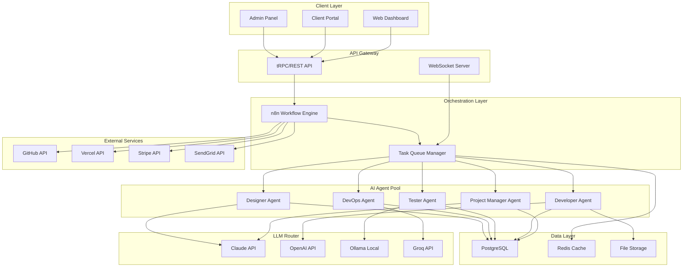
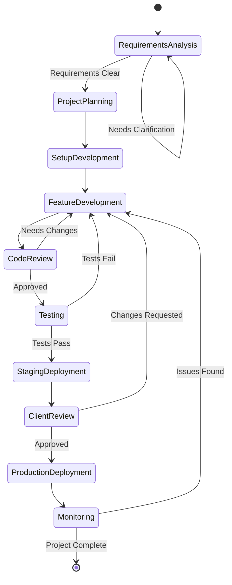
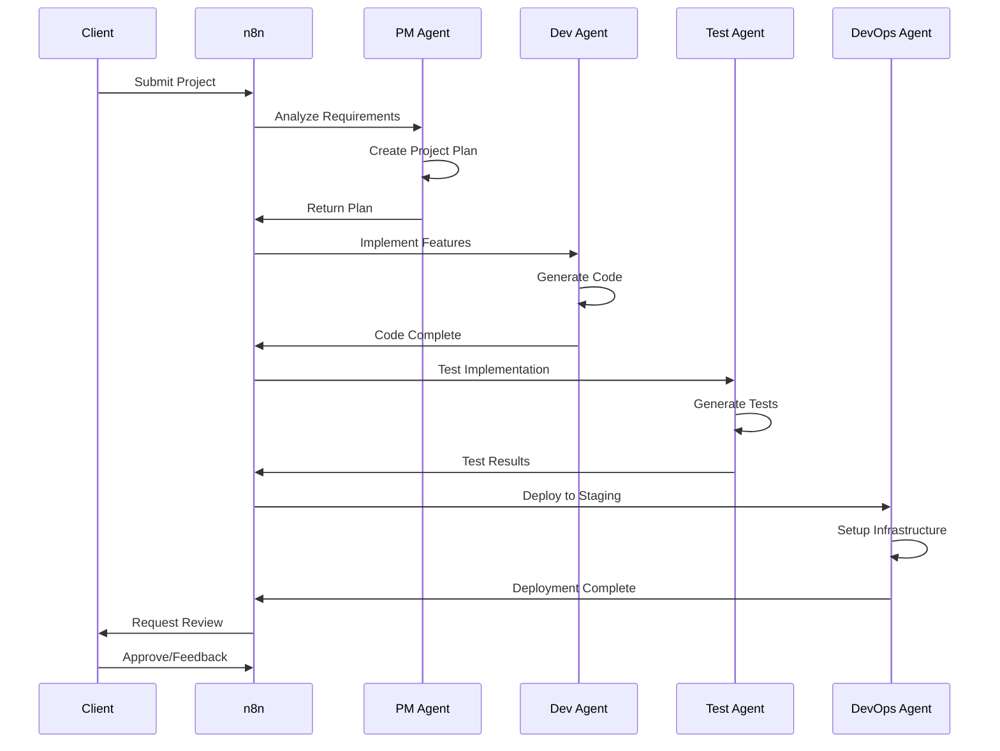

# Virtual IT Company Platform - System Architecture

## Overview

The Virtual IT Company Platform is an autonomous AI-powered software development company that operates 24/7, handling multiple client projects simultaneously through intelligent AI agents. This document outlines the technical architecture, system components, and their relationships.

## Architecture Principles

### 1. Microservices Architecture
- **Separation of Concerns**: Each service handles specific responsibilities
- **Scalability**: Services can be scaled independently based on demand
- **Resilience**: Failure isolation prevents system-wide outages
- **Technology Agnostic**: Different services can use optimal tech stacks

### 2. Event-Driven Design
- **Asynchronous Processing**: Non-blocking operations for better performance
- **Real-time Updates**: WebSocket connections for live project tracking
- **Message Queuing**: Redis for reliable task distribution
- **Workflow Orchestration**: n8n for visual workflow management

### 3. AI-First Approach
- **Multi-Agent Collaboration**: Specialized agents for different roles
- **Multi-LLM Support**: Intelligent routing between AI providers
- **Cost Optimization**: Smart model selection based on task complexity
- **Continuous Learning**: Self-improving error recovery systems

## System Components

### Core Services



## Component Details

### 1. Client Layer
- **Web Dashboard**: Next.js application for project management
- **Client Portal**: Real-time project tracking and feedback
- **Admin Panel**: System monitoring and configuration

### 2. API Gateway
- **tRPC**: Type-safe API endpoints
- **REST API**: Legacy compatibility and webhooks
- **WebSocket Server**: Real-time agent communication

### 3. Orchestration Layer
- **n8n**: Visual workflow designer and executor
- **Redis Queue**: Task distribution and prioritization
- **Celery Workers**: Background job processing

### 4. AI Agent Pool
Each agent is specialized for specific tasks:

#### Project Manager Agent
- Requirements analysis and clarification
- Project planning and timeline estimation
- Resource allocation and task assignment
- Client communication management

#### Developer Agent
- Code generation and implementation
- API development and integration
- Database design and optimization
- Frontend/backend development

#### Tester Agent
- Test plan creation
- Unit and integration test generation
- Bug detection and reporting
- Performance testing

#### DevOps Agent
- CI/CD pipeline setup
- Deployment automation
- Infrastructure management
- Monitoring and alerting

#### Designer Agent
- UI/UX design generation
- Component styling
- Responsive design implementation
- Design system maintenance

### 5. Multi-LLM Router

Intelligent routing based on:
- **Task Complexity**: Simple tasks use cheaper models
- **Response Time**: Critical tasks use faster models
- **Budget Constraints**: Automatic fallback to cheaper alternatives
- **Specialization**: Code tasks prefer CodeLlama, analysis prefers Claude

```yaml
Model Selection Matrix:
  Simple Tasks (Complexity 1-3):
    Primary: Ollama Mistral (Free)
    Fallback: Claude Haiku ($0.25/1k)
    
  Medium Tasks (Complexity 4-7):
    Primary: Claude Sonnet ($3/1k)
    Fallback: GPT-4o-mini ($0.15/1k)
    
  Complex Tasks (Complexity 8-10):
    Primary: Claude Opus ($15/1k)
    Fallback: GPT-4o ($5/1k)
```

### 6. Data Layer

#### PostgreSQL
- Project metadata and configuration
- User management and authentication
- Billing and subscription data
- Audit logs and analytics

#### Redis
- Task queue management
- Real-time project state
- Session management
- Caching layer

#### File Storage
- Generated code repositories
- Project documentation
- Client uploads
- Build artifacts

## Workflow Architecture

### Project Lifecycle Workflow



### Agent Communication Flow



## Scalability Strategy

### Horizontal Scaling
- **Agent Pool Expansion**: Add more agent instances for parallel processing
- **Load Balancing**: Distribute requests across multiple instances
- **Database Sharding**: Partition data for better performance
- **CDN Integration**: Global content delivery for client portals

### Vertical Scaling
- **Resource Allocation**: Increase compute resources for complex projects
- **Model Upgrades**: Use more powerful LLMs for critical tasks
- **Caching Optimization**: Reduce redundant API calls
- **Query Optimization**: Database performance tuning

## Security Architecture

### Authentication & Authorization
- **JWT Tokens**: Secure API authentication
- **Role-Based Access**: Granular permission control
- **OAuth Integration**: Third-party authentication
- **API Key Management**: Secure credential storage

### Data Protection
- **Encryption at Rest**: Database and file encryption
- **Encryption in Transit**: TLS/SSL for all communications
- **Secret Management**: Environment variable isolation
- **Audit Logging**: Comprehensive activity tracking

### Infrastructure Security
- **Container Isolation**: Docker security best practices
- **Network Segmentation**: VPC and firewall rules
- **Regular Updates**: Automated security patching
- **Vulnerability Scanning**: Continuous security monitoring

## Deployment Architecture

### Development Environment
```yaml
Infrastructure: Local Docker Compose
AI Models: Ollama (Local)
Database: SQLite + Redis
Cost: $0/month
Capacity: 1-2 projects
```

### Staging Environment
```yaml
Infrastructure: Single VPS (DigitalOcean)
AI Models: Ollama + Claude API
Database: PostgreSQL + Redis
Cost: $50-100/month
Capacity: 3-5 projects
```

### Production Environment
```yaml
Infrastructure: Multi-server deployment
AI Models: Multi-LLM with intelligent routing
Database: Managed PostgreSQL + Redis Cluster
Cost: $200-500/month
Capacity: 20+ projects
```

## Monitoring & Observability

### Application Monitoring
- **Performance Metrics**: Response times, throughput
- **Error Tracking**: Sentry integration
- **Uptime Monitoring**: Service availability
- **Resource Usage**: CPU, memory, disk metrics

### Business Metrics
- **Project Completion Rate**: Success/failure tracking
- **AI Cost Analysis**: Per-project LLM usage
- **Client Satisfaction**: Feedback scores
- **Revenue Tracking**: Billing and profitability

### Logging Strategy
- **Centralized Logging**: ELK stack or similar
- **Log Levels**: Debug, Info, Warning, Error
- **Log Retention**: 30-day rolling window
- **Search & Analysis**: Full-text search capabilities

## Disaster Recovery

### Backup Strategy
- **Database Backups**: Daily automated backups
- **Code Repositories**: Git-based version control
- **Configuration Backups**: Infrastructure as Code
- **Document Backups**: Client data protection

### Recovery Procedures
- **RTO Target**: 4 hours
- **RPO Target**: 1 hour
- **Failover Process**: Automated health checks
- **Data Recovery**: Point-in-time restoration

## Future Architecture Considerations

### Phase 1: MVP (Months 1-3)
- Single server deployment
- Basic agent implementation
- Manual monitoring
- Limited concurrent projects

### Phase 2: Growth (Months 4-6)
- Multi-server architecture
- Advanced agent capabilities
- Automated monitoring
- 10+ concurrent projects

### Phase 3: Scale (Months 7-12)
- Kubernetes orchestration
- Global deployment
- ML-based optimization
- 50+ concurrent projects

### Phase 4: Enterprise (Year 2+)
- Multi-region deployment
- White-label solutions
- Advanced analytics
- 100+ concurrent projects

## Conclusion

The Virtual IT Company Platform architecture is designed for scalability, reliability, and cost-effectiveness. By leveraging modern cloud-native technologies and AI capabilities, the system can grow from a single-developer operation to a full-scale autonomous software company handling dozens of concurrent projects.